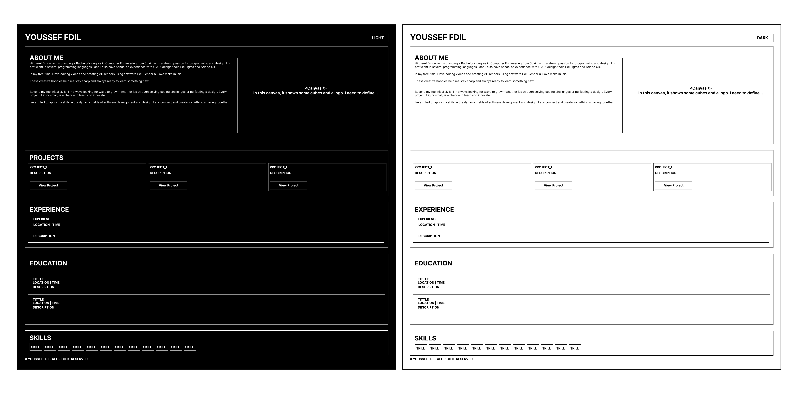

# Youssef FDIL - Full Stack Developer & UI/UX Enthusiast

Welcome to my personal portfolio! I'm Youssef FDIL, a passionate Full Stack Developer and UI/UX enthusiast. Here you can explore my work, learn about my skills, and connect with me. This portfolio showcases my professional journey, skills, and projects, all crafted with love and creativity.

## 🚀 Technologies Used

- **React.js**: The main library for building the user interface.
- **Tailwind CSS**: Utility-first CSS framework used for styling the portfolio.
- **Vite.js**: Fast and optimized build tool for a faster development experience.
- **Lucide Icons**: Elegant icons for enhancing the user interface.

## 📚 Sections

1. **About Me**: Learn more about my journey as a developer and my passion for coding and design.
2. **Skills**: A comprehensive list of technologies and tools I’m proficient in, ranging from frontend to backend development.
3. **Projects**: A collection of my most significant projects, including links to live demos and GitHub repositories.
4. **Contact**: Get in touch with me via email or connect on my social platforms.

## 🌐 Visit the Portfolio

You can view the live version of my portfolio by clicking the link below:

[Visit My Portfolio](https://yfb-portfolio.vercel.app/)

## Preview

## 📫 Connect With Me

Feel free to connect with me on social media or reach out through email:

- [LinkedIn](https://www.linkedin.com/in/youssef-fdil-6b6497187/)
- [GitHub](https://github.com/yousseffdil)
- [Email](mailto:fdilyoussef@gmail.com)

---

Crafted with ❤️ using `<Code />` & `<Creativity />`
